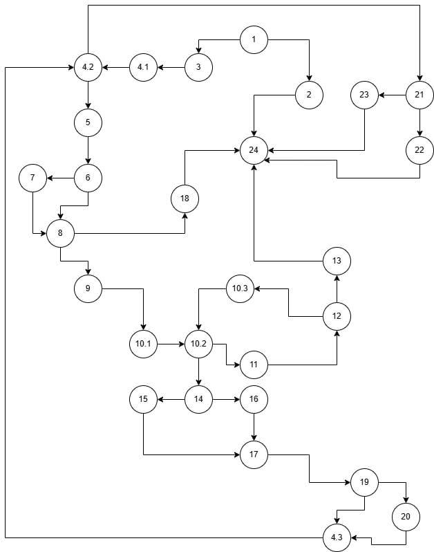

 # SI_2024_lab2_226022
Filip Ilieski 226022

2. CFG

3. Цикломатска комплексност
   
Број на ребра - Број на јазли + 2 = 36 - 28 + 2 = 10

Со помош на горенаведената формула ја пресметав цикломатската комплексност.

4. Тест случаи за Every Branch
|Branches | allitems=["Test27", "276f", 50, 0], payment=101 | allitems=[], paument=101 | allitems=[null, "276276", 150, 0], payment=121 | allitems=["Test27", null, X, X], payment=101 | allitems=["Test27", "0123", 333, 10], payment=159 | 1 (true) |
|---------|-------------------------------------------------|--------------------------|------------------------------------------------|----------------------------------------------|---------------------------------------------------|----------|
|1-2      |0                                                |1                         |0                                               |0                                             |0                           
          | true                 |
|1-3          |1|0|1|1|1| true |
|2-24          |0|1|0|0|0| true |
|3-4.1         |1|0|1|1|1| true |
|4.1-4.2       |1|0|1|1|1| true |
|4.2-5|1|0|1|1|1| true|
|5-6|1|0|1|1|1| true|
|6-7|0|0|1|0|0| true|
|6-8|1|0|0|1|1| true|
|7-8|0|0|1|0|0| true|
|8-9|1|0|1|0|1| true|
|8-18|0|0|0|1|0| true|
|18-24|0|0|0|1|0| true|
|9-10.1|1|0|1|0|1| true|
|10.1-10.2|1|0|1|0|1| true|
|10.2-11|1|0|1|0|1| true|
|10.2-14|0|0|1|0|1| true|
|11-12|1|0|1|0|1| true|
|12-10.3|1|0|1|0|1| true|
|10.3-10.2|1|0|1|0|1| true|
|12-13|1|0|0|0|0| true|
|13-24|1|0|0|0|0| true|
|14-15|0|0|0|0|1| true|
|14-16|0|0|1|0|0| true|
|15-17|0|0|0|0|1| true|
|16-17|0|0|1|0|0| true|
|17-19|0|0|1|0|1| true|
|19-20|0|0|0|0|1| true|
|19-4.3|0|0|1|0|0| true|
|20-4.3|0|0|0|0|1| true|
|4.3-4.2|0|0|1|0|1| true|
|4.2-21|0|0|1|0|1| true|
|21-22|0|0|1|0|0| true|
|21-23|0|0|0|0|1| true|
|23-24|0|0|0|0|1| true|
|22-24|0|0|1|0|0| true|

5. Multiple condition

| number | item.getPrice>300 | item.getDiscount>0 | item.getBarcode.charAt(0)=='0' |
| ------ | ----------------- | ------------------ | ------------------------------ |
| T      | T                 | T                  | T                              |
| T      | F                 | X                  | F                              |
| T      | T                 | F                  | F                              |
| F      | X                 | X                  | F                              |

number 1 test case: item.getPrice = 357 | item.getDiscount = 50 | item.getBarcode.charAt(0)=='0258'
number 2 test case: item.getPrice = 357 | item.getDiscount = -50 | item.getBarcode.charAt(0)== X
number 3 test case: item.getPrice = 357 | item.getDiscount = 50 | item.getBarcode.charAt(0)=='xyz'
number 4 test case: item.getPrice = 27 | item.getDiscount = X | item.getBarcode.charAt(0)== X
